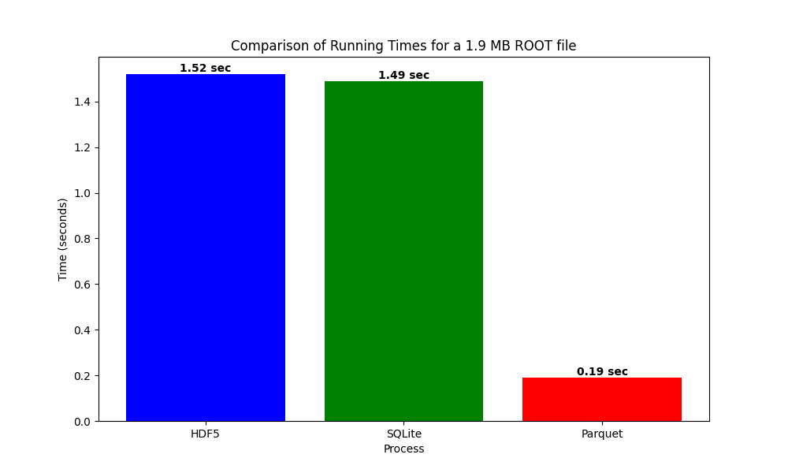
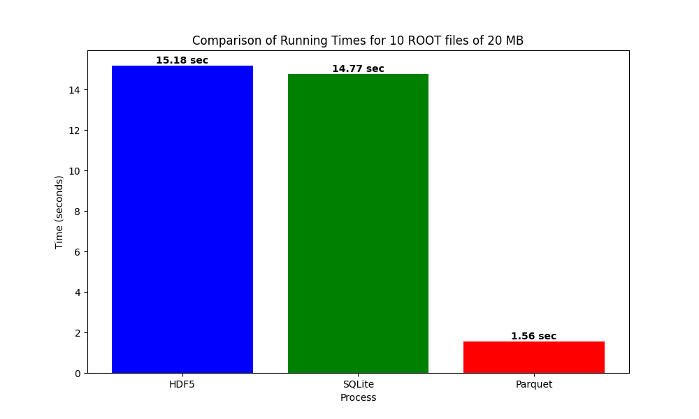

 

# Convert .root files to other data formats 
#### *from ROOT..  to HDF5/ SQLite/ Parquet*  💻 ⚙️

## Abstract

This repository provides a Python toolset for converting ROOT files to another format. It includes functionalities for reading data from ROOT files branches and saving them as other file formats.

Additionally, we can explore the file structure & print a dataframe. Furthermore, the mutual compatibility and installation of the Python packages used to read and convert .root files ensure minimal dependency conflicts

**<ins>The scope of this work, was to create a general tool for converting ROOT files to other formats.</ins>**

## Usage

1) _Directory Structure_ - Construct the following directories in your project:
    - data/root: Ensure that you have this directory containing ROOT files.
    - data/h5: Directory where HDF5 files will be saved (if not present it will be created).
    - data/sqlite: Directory where SQLite files will be saved (if not present it will be created).
    - data/parquet: Directory where Parquet files will be saved (if not present it will be created).

    
2) _User Interface_ -  Upon running the script, you'll be prompted to choose one of the following options:
    - Read a HDF5 | SQLite | Parquet file
    - Convert ROOT files to HDF5 | SQLite | Parquet
    - Exit the program.

## Project structure:

```
root2data/
│
├── .gitignore
├── LICENCSE
├── README.md
├── create_env.sh
├── main.py
├── requirements.txt
├── data/ # this folder is created if not present
│   ├── h5/
│   ├── parquet/
│   ├── root/
│   └── sqlite/
├── utils/
│   ├── __init__.py 
│   ├── conversion.py
│   ├── data_ops.py
│   ├── file_ops.py
│   ├── hdf5_ops.py
│   ├── parquet_ops.py
│   ├── sqlite_ops.py
│   └── ui_ops.py
└── src/
    └── transform.py

```
## ROOT file structure:
#### Our ROOT files have the following structure:

```
root_file/
│
├── Tree;1/
│   ├── variable_1.1
│   ├── variable_1.2
│   ├── variable_1.3
│   ...
│   └── variable1_N
│
├── Tree;2
│   ├── variable_2.1
│   ├── variable_2.2
│   ├── variable_2.3
│   ...
│   └── variable_2.N
...
└── Tree;M/
    ├── variable_M.1
    ├── variable_M.2
    ├── variable_M.3
    ...
    └── variable_M.N
```
The .root files used for conversion had been generated with ROOT6.30 but the simple structure of these file ensure compatibility with most updated ROOT versions.
## Prerequisites

The following will create a python virtual environment at the same time activate it:

```
source create_env.sh
```

Then execute the following to install required packages:
```
pip install -r requirements.txt
```
You have now created a virtual env called *root2data*

## Walkthrough

1. Clone the repository.
```
git clone https://github.com/appINPP/root2data.git
```


2. #### Create the virtual environment, as discusssed above in the prerequisites section.

3. #### Execute the main.py and select the desired features (**seperate them with space**).
```
python3 main.py --features event feature_X feature_Y feature_Z
```

4. #### You are prompted to select an action (here, we select 2).
   
   

5. #### In this section, we can determine the format of the output file (here, we select 1).
   
   
   
6. #### You can choose to convert all detected root files or choose specific files (here, we select 1).
   
   

7.  #### The conversion pipeline is initiated and the files are converted. Our process indicates if the declared features are found and in which root file tree.
   
   

8.  #### After conversion you are ready read the h5 files that you created by.
   
  
  
9. #### For the h5 file, you can also read the data structure and print it as a dataframe.
   
  
  


## Conversion Time Comparisons

### 1 random ROOT file


### 10 ROOT files


### 1 big ROOT file


## Communication
Please feel free to contact

<a href="mailto:appinpp.group@gmail.com?"></a>

appinpp.group@gmail.com
## License

This project is licensed under the Apache License. See the [LICENSE](https://github.com/appINPP/root2data/blob/main/LICENSE) for details.

